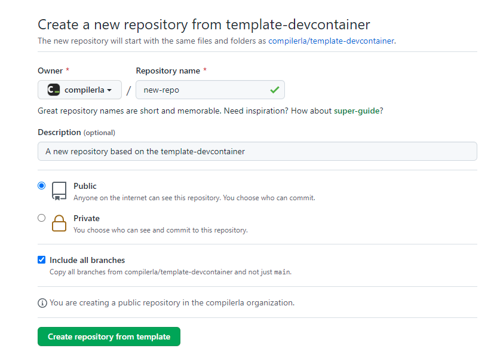

# Generate a new repository

!!! info "See also"

    GitHub docs: [Creating a repository from a template](https://docs.github.com/en/repositories/creating-and-managing-repositories/creating-a-repository-from-a-template)

The simplest way to get started is to create a new repository from the template:

[Generate a new repository from the template](https://github.com/compilerla/template-devcontainer/generate){.md-button}

This will copy the files and directory structure from the template into a new repository of your choosing.

If you intend to publish a [Documentation website](../features/docs.md), be sure to make this a `Public` repository and check the
box to `Include all branches`:

