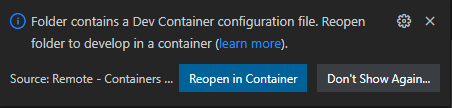

# Run the devcontainer locally

!!! info "See also"

    VS Code tutorial: [Remote development in Containers](https://code.visualstudio.com/docs/remote/containers-tutorial)

## Prerequisites

### Docker

Docker is required; the easiest way to get Docker is by downloading and installing [Docker Desktop](https://www.docker.com/products/docker-desktop/) for Linux, Mac (including Apple Silicon!) and Windows.

### VS Code

You will also need [VS Code](https://code.visualstudio.com/) and the
[`Remote - Containers` extension](https://marketplace.visualstudio.com/items?itemName=ms-vscode-remote.remote-containers) installed.

### Source code

Ensure you have a local copy of this template repository:

```shell
git clone https://github.com/compilerla/template-devcontainer
```

Or another repository you generated from this template.

## Open the repo in VS Code

From the command line:

```shell
code /path/to/repository
```

Or from the VS Code UI:

`File > Open Folder > /path/to/repository`

## Reopen in devcontainer

At this point, the VS Code UI should prompt you to reopen the folder in the devcontainer:



### Rebuild and Reopen

To completely rebuild the devcontainer from scratch and reopen the VS Code window, attached to the running devcontainer:

1. Bring up the VS Code _Command Palette_ with: `Ctrl/Cmd + Shift + P`
1. Enter `Remote-Containers` to filter the list
1. Enter or select the `Rebuild and Reopen in Container` option

### Reopen

To reopen VS Code attached to the most recently built and used devcontainer (the build is skipped if not needed):

1. Bring up the VS Code _Command Palette_ with: `Ctrl/Cmd + Shift + P`
1. Enter `Remote-Containers` to filter the list
1. Enter or select the `Reopen in Container` option

## Close the devcontainer

From within the devcontainer, to close the connection and reopen VS Code on your local (host) machine:

1. Bring up the VS Code _Command Palette_ with: `Ctrl/Cmd + Shift + P`
1. Enter `Remote-Containers` to filter the list
1. Enter or select the `Reopen Folder Locally` option
